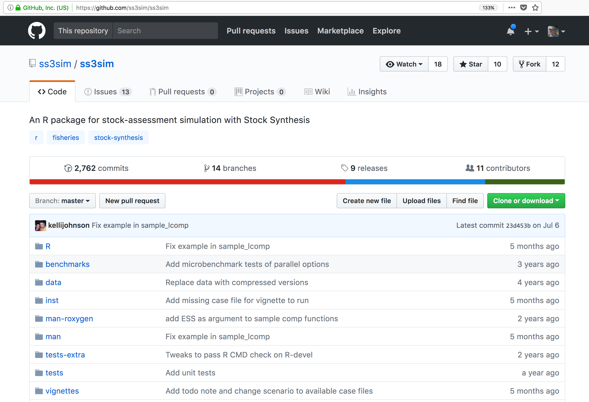
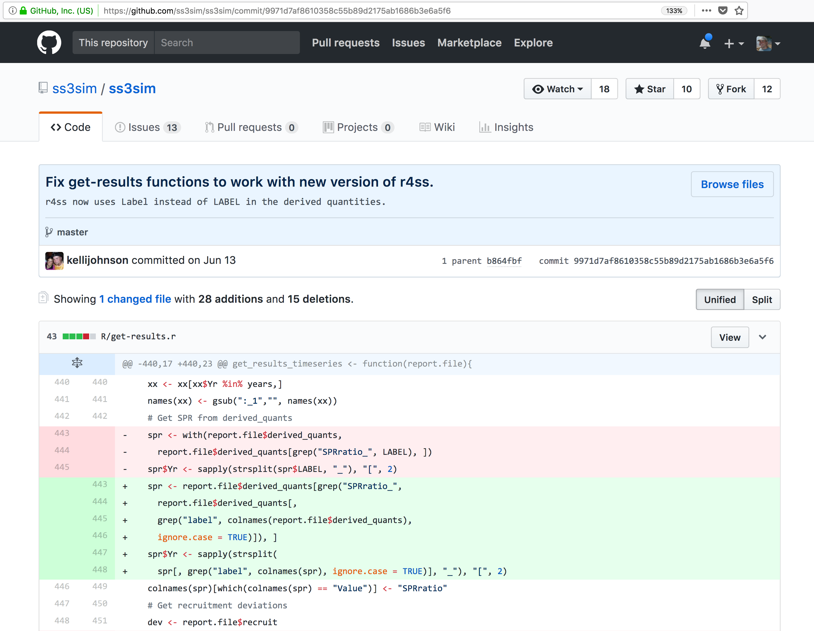
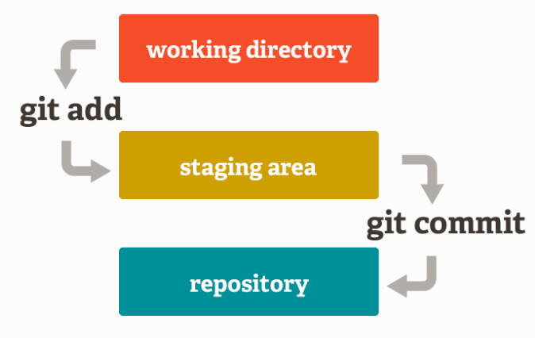

```{r setup, include=FALSE}
knitr::opts_chunk$set(echo = TRUE)
```

<br>
<br>
This document is a compilation of [NCEAS](https://github.com/NCEAS/) training material on version control to create a 45-60 min crash course on getting started with version control for RStudio users. You will learn:

- how to setup git on your machine
- how to create repository on GitHub
- git basic workflow an manipulations using RStudio
- Collaborating using git and GitHub

<br>

# Introduction to version control concepts

Version control is a system that helps you to manage the version of your files. It will help you to never have to duplicate files using `save as` as a way to keep different versions of a file (see below). Version control help you to create a timeline of snapshots containing different versions of a file. Bonus you can add a short description to remember what each specific version is about.

```{r file version craziness, out.width='60%', fig.align='center', echo = FALSE}
knitr::include_graphics("images/phd_comics_final.png")
```


For scientists, version control is a useful tool to help you to track changes you make to your **scripts** and enable you to share your codes with your collaborators. For example, if you break your code, git can help you to revert to an earlier working version. Another example could be that you want one of your collaborators to add a new feature to your code to improve your analysis? Version control can help you to do so in a smooth and organized manner, tracking who changed what in the script.

---

<br>

# git 

This training material focuses on the code versioning system called `Git`. Note that there are others, such as `Mercurial` or `svn` for example.

Git is a *free* and *open source* distributed *version control system*. It has many functionalities and was originally geared towards software development and production environment. In fact, Git was initially designed and developed in 2005 by Linux kernel developers (including Linus Torvalds) to track the development of the Linux kernel. Here is a [fun video](https://www.youtube.com/watch?v=4XpnKHJAok8) of Linus Torvalds touting Git to Google. 

## How does it work?

Git can be enabled on a specific folder/directory on your file system to version files within that directory (including sub-directories). In git (and other version control systems) terms, this “tracked folder” is called a **repository** (which formally is a specific data structure storing versioning information).

# What git is not

- Git is not a backup per se
- Git is not good at versioning large files (there are workarounds) => not meant for data

---

<br>

# Setting up git on your computer

`MacOSX` and `Linux` computers all come with git pre-install, but not always directly usable. The best way to test if `git` is ready to use is at the command line:

```{bash git test}
git --version
```

It should return something like above. *If you get an error, you will have to install git**


`Windows` users will have to install a software called `git bash` before being able to use git.


## Installing git

You can download a copy of `git` here: https://git-scm.com/downloads and follow the instructions. 


### Windows

You can keep the options to default during the installation, until you reach `Configuring the terminal emulator to use with Git Bash` -> be sure `Use MinTTY` is selected.  This will install both git and a set of useful command-line tools using a trimmed down Bash shell. 


### Mac OSX 

Depending on the version, you might have to run few commands from the terminal. Please refer to the `README.txt` that comes with the download regarding the exact steps to follow.


## Setting up your `git` identity

Before you start using git on any computer, you will have to set your identity on your system, as every snapshot of files is associated with the user whom implemented the modifications to the file(s).

Open the `Terminal` or `git bash` and then type the following commands.

### Setup your profile

Your name and email: 

```{bash git identity, eval=FALSE}
git config --global user.name "your Full Name"
git config --global user.email "your Email"
```

### Optional

Check that everything is correct: 

```{bash git config list, eval=FALSE}
git config --global --list
```

Modify everything at the same time:

```{bash git config edit, eval=FALSE}
git config --global --edit
```

Set your text editor: 

```{bash git config editor, eval=FALSE}
git config --system core.editor nano
```

Here [`nano`]() is used as example; you can choose most of the text editor you might have installed on your computer (atom, sublime, notepad++ ...).

Problem with any of those steps? Check out Jenny Brian [Happy git trouble shooting section] (http://happygitwithr.com/troubleshooting.html){target="_blank"}

## Linking git and RStudio

In most of the cases, RStudio should automatically detect `git` when it is installed on your computer. The best way to check this is to go to the `Tools` menu `-> Global Option`s and click on `git/SVN`

If `git` is properly setup, the window should look like this:


Click `OK`. 

_Note:_ if `git` was not enabled, you might be asked to restart RStudio to enable it.

---

<br>

# First Repository

Git can be enabled on a specific folder/directory on your file system to version files within that directory (including sub-directories). In git (and other version control systems) terms, this “tracked folder” is called a **repository** (which formally is a specific data structure storing versioning information).

Although there many ways to start a new repository, [GitHub](https://github.com/) (or any other could solutions, such as [GitLab](https://about.gitlab.com/)) provide among the most convenient way of starting a repository.


## GitHub  

Let's distinguish between git and GitHub:

- __git__: version control software used to track files in a folder (a repository)
    - git creates the versioned history of a repository
- __GitHub__: web site that allows users to store their git repositories and share them with others
	
**GitHub is a company that hosts git repositories online** and provides several collaboration features (among which `forking`). GitHub fosters a great user community and has built a nice web interface to git, also adding great visualization/rendering capacities of your data.

- **GitHub.com**: <https://github.com>
- **A user account**: <https://github.com/brunj7>
- **An organization account**: <https://github.com/nceas>
- **NCEAS GitHub instance**: <https://github.nceas.ucsb.edu/> 

## Let's look at a GitHub repository

This screen shows the copy of a repository stored on GitHub,
with its list of files, when the files and directories were last modified, 
and some information on who made the most recent changes.  


If we drill into the 
"commits" for the repository, we can see the history of changes made to all of 
the files.  Looks like `kellijohnson` and `seananderson` were fixing things in
June and July:


And finally, if we drill into the changes made on June 13, we can see exactly what
was changed in each file:


Tracking these changes, how they relate to released versions of software and files
is exactly what Git and GitHub are good for.  And we will show how they can really 
be effective for tracking versions of scientific code, figures, and manuscripts
to accomplish a reproducible workflow.


## Creating a Repository on GitHub

We are going to create a new repository on your GitHub account:

- Click on 
- Enter a descriptive name for your new repository, `myfirst-repo`  
(avoid upper case and use `-` instead of spaces or `_`)
- Write a 1-sentence description about the repository content
- Choose **"Public"** (Private repositories are not free)
- Check **"Initialize this repository with a README"**
- Add a `.gitignore` file (optional). As the name suggest, the gitignore file is used to specify the file format that git should not track. GitHub offers pre-written gitignore files for commodity
- Add a license file (optional) 


 Here is a website to look for more pre-written`.gitignore` files: <https://github.com/github/gitignore>

<br>

**=> Here it is, you now have a repository in the cloud!!** 

 

<br>


## Getting a Local Copy of a Repository

The next step is going to **get a local copy of this repository to your personal computer**. In git jargon, creating an exact copy of a repository on your local computer is called **cloning**.

RStudio can help us to clone a repository. *Since `RStudio Projects` also work at the folder/directory level, it is the "unit" that is going to be used to link a repository to RStudio.*

1. You can create a new `RStudio Project` from the upper-right corner of the RStudio IDE window, choosing *New Project*  
```{r RStudio project, out.width='30%', fig.align='center', echo = FALSE}
knitr::include_graphics("images/rstudio-project.png")
```
2. Choose *Version Control*  
```{r RStudio project version control panel, out.width='50%', fig.align='center', echo = FALSE}

```
3. Select `git`
4. Go back to your web browser and from the GitHub repository page click on the green `clone or download` button and copy the URL to your repository  

5. Paste this URL in the first box and leave the second box empty. Finally select a location on your HD where the repository will be cloned to.
```{r RStudio project git panel, out.width='50%', fig.align='center', echo = FALSE}
knitr::include_graphics("images/rstudio-project-clone.png")
```
6. Click `Create Project`


<br>

** => Congratulations!! you have cloned the repository to your computer and created a RStudio project out of it.**

```{r Cloned repository, fig.align='center', echo = FALSE}
knitr::include_graphics("images/repo-cloned.png")
```


<br>

You can also use your computer file browser to look at the files in the repository. You have two files:

- The `my-repo-name.Rproj` file for the RStudio Project you just created. Note that because we left the second box empty on step 5, the name of the repository was used to name the RStudio project.
- The `README.md` file that was automatically generated by GitHub when creating the repository

```{r Finder files view, out.width='50%', fig.align='center', echo = FALSE}
knitr::include_graphics("images/repo-finder-view.png")
```

If you look again at your repository page on GitHub you will noticed that the `.Rproj` file is not there. It is because this file was created by RStudio on your local machine and you have not yet try to synchronize the files between your local copy and the one in the cloud (remote copy in git jargon). Note also that the `.gitignore` file is not showing up in the Finder view. It is because files with a name starting with a dot are considered "hidden". By default most of OS will not show those files. However if you use the `Files` panel in RStudio, you can see the `.gitignore` file.

```{r rstudio files view, out.width='50%', fig.align='center', echo = FALSE}
knitr::include_graphics("images/rstudio-files-view.png")
```

We are going to edit the `README.md` file, adding more information about the repository (purpose of the this file). You can directly edit this file in RStudio. You can open the file by clicking on its name from the `Files` tab in the lower-right panel.

---

<br>

# Tracking your file changes with `git` 

## Basic Workflow Overview



1. You modify files in your working directory and save them as usual

2. You **add** snapshots of your changed files to your staging area

3. You do a **commit**, which takes the files as they are in the staging area and permanently stores them as snapshots to your Git directory.


We can make an analogy with taking a family picture, where each family member would represent a file.

- **Add**ing files (to the staging area), is like deciding which family member(s) are going to be on your next picture
- **Commit**ting is like taking the picture

These 2-step process enables you to flexibly group files into a specific commit.

These steps are repeated for every version you want to keep (every time you would like to use `save as`). Every time you commit, you create a new snapshot, you add the new version of the file to the git database, while keeping all the previous versions in the database. It creates an history of the content of your repository that is like a graph that you can navigate:


---

<br>

# Collaborative Workflows with `GitHub`

## Forking

## Push Access
