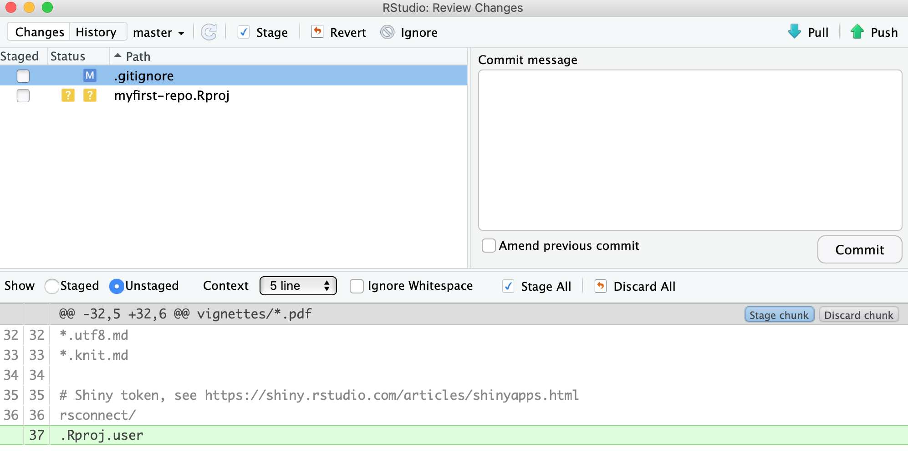

```{r setup, include=FALSE}
knitr::opts_chunk$set(echo = TRUE)
# rmarkdown::render("getting-started-with-git-rstudio.Rmd", output_dir = "docs")
```

<br>
<br>
This document is a compilation of [NCEAS](https://github.com/NCEAS/) training material on version control to create a 45-60 min crash course on getting started with version control for RStudio users. You will learn:

- how to setup git on your machine
- how to create repository on GitHub
- git basic workflow an manipulations using RStudio
- Collaborating using git and GitHub

<br>

<br>

```{r version control, child = './modules/version-control-intro.Rmd'}

```

---

<br>

```{r git intro, child = './modules/git-intro.Rmd'}

```


---

<br>

```{r setting computer, child = './modules/git-setting-computer.Rmd'}

```

---

<br>

```{r first repo, child = './modules/git-first-repo.Rmd'}

```

---

<br>

# Tracking File Changes with `git` 

## Basic Workflow Overview


1. You modify files in your working directory and save them as usual

2. You **add** snapshots of your changed files to your staging area

3. You do a **commit**, which takes the files as they are in the staging area and permanently stores them as snapshots to your Git directory.


We can make an analogy with taking a family picture, where each family member would represent a file.

- **Add**ing files (to the staging area), is like deciding which family member(s) are going to be on your next picture
- **Commit**ting is like taking the picture

These 2-step process enables you to flexibly group files into a specific commit.

These steps are repeated for every version you want to keep (every time you would like to use `save as`). Every time you commit, you create a new snapshot, you add the new version of the file to the git database, while keeping all the previous versions in the database. It creates an history of the content of your repository that is like a graph that you can navigate:


## Using git from Rstudio

### Tracking changes

RStudio provides a great interface to git helping you naviating the git workflow and getting information about the state of your repository through nice icons and visualizations of the information.

If you click on the `Git` tab in your RStudio upper-right panel, you should see the following information

```{r RStudio git pane, out.width='60%', fig.align='center', echo = FALSE}
knitr::include_graphics("images/rstudio-git-panel.png")
```
The RStudio Git pane lists every file that’s been added, modified or deleted. The icon describes the change:

```{r RStudio git icons, out.width='80%', fig.align='left', fig.cap="from R packages, H. Wickham", echo = FALSE}
knitr::include_graphics("images/rstudio-git-icons.png")
```

In our case, it means that:

- the `.gitignore`file has been modified since the last commit
- the  `.Rpoj` file has never been tracked by `git`  (remember RStudio just created this project file for us)

Note also that the `README.md` file is not listed, but it exists, see `Files`pane. It is because files with no modifications since last commit are not listed. 

Github has created the `.gitignore` file for us and we have not modfied it since. So why is it listed as modified? We can check this by clicking on the `Diff` button (upper-left on the Git pane).

```{r RStudio git diff, out.width='70%', fig.align='center', echo = FALSE}

```

We can see that a new line (in green) has been added at the end of the `.gitignore` file. In fact, RStudio did that when creating the project to make sure that some temporary files are not tracked by git.

Let us improve the content of the `README.md` file  as below to make it more descriptive.

```{r RStudio readme, out.width='70%', fig.align='center', echo = FALSE}
knitr::include_graphics("images/rstudio-git-readme.png")
```

As soon as you saved your changes, you should see the `README.md` file listed as modified in the git pane.

```{r RStudio git pane mod, out.width='70%', fig.align='center', echo = FALSE}
knitr::include_graphics("images/rstudio-git-panel-modified.png")
```

Let us look at the diff of the `README.md` file. As you can see, the original lines are in red, in other words for git those lines have been deleted. The new lines that we just typed are in green, in other words these lines have been added for git. Note the line numbers in the left margin that help you to track which line have been removed and added.


```{r RStudio git diff readme, out.width='70%', fig.align='center', echo = FALSE}
knitr::include_graphics("images/rstudio-git-diff-readme.png")
```

### Keeping Changes as Snapshots

Now we would like to save a snapshot of this version of the `README.md` file. Here are the steps we will need to do:

1. Add the file to the next commmit by checking the box in front of the filename in the git pane.  
Note that the icon `M` will move to the left to show you that this file is now staged to be part of the next commit
2. Commit:
    a. Click the `Commit` button at the top of the git pane
    b. Write a short but descriptive commit message in the new window
    c. Click on the he `Commit` button to save this version of the file in the git database
    d. Close the windows to get back to the main RStudio window

```{r RStudio git first commit, out.width='70%', fig.align='center', echo = FALSE}
knitr::include_graphics("images/rstudio-git-first-commit.png")
```


Once done, add both the `.gitignore` and the `myfirst-repo.Rproj` and commit those files together.

 Note that the icons at the top of the git pane have been organized in sequence from left to right to match the git workflow.

## Looking at the Repository History

We have done 2 new commits at this point. Let us look at the commit timeline we have created so far. You can click on the `Clock` icon at the top to visualize the history.

```{r RStudio git history, out.width='70%', fig.align='center', echo = FALSE}
knitr::include_graphics("images/rstudio-git-history.png")
```

You can see that there has been 3 commits so far. The first one has been done by GitHub when we created the repository and the 2 commits we just did. The most recent commit is at the top.


## Sending changes back to GitHub

Now that we have created these two commits on our local machine, our local version of the repository is different from the version on GitHub. RStudio communicate you this information. If you look below the icons on the git pane, you will see the warning message: "Your branch is ahead of 'origin/master' by two commits". This can be translated as you have two additional commits on your local machine that you never shared back to the remote repository on GitHub. Open your favorite web browser and look at the content of your repository on GitHub. You will see the old version of the `README.md` and `.gitignore` file and no trace of the `.Rproj` file.

```{r RStudio git 2 local commits, fig.align='center', echo = FALSE}
knitr::include_graphics("images/repo-not-synched.png")
```

There are two git commands to exchange between a local and remote versions of a repository:
- `pull`: git will get the latest remote version and try to merge it with your local version
- `push`: git will send your local version to the remote version of the repository (in our case GitHub)

Before sending your local version to the remote, you should always get the latest remote version first. IN other words, you should pull first and push second. It is the way git is protecting the remote version against incompatibilites between the two versions. You always deal with potential problems on your local machine. Therfore your sequence will always be:

1. `pull`
2. `push`

Of course RStudio have icons for that on top of the git pane, with the blue arrow down beeing for `pull` and the gree arrow up being for `push`. Rember the icons are organized in sequence!

Let us do the pull and push to synchornized the remote repositories. We have now synchronized the local (our computer) and remote (on GitHub) versions of our repository.

```{r RStudio git, repo in sync, fig.align='center', echo = FALSE}
knitr::include_graphics("images/repo-synched.png")
```

## On Good Commit Message Tips

Clearly, good documentation of what you’ve done is critical to making the version history of your repository meaningful and helpful. Its tempting to skip the commit message altogether, or to add some stock blurd like ‘Updates’. Its better to use messages that will be helpful to your future self in deducing not just what you did, but why you did it. Also, commit messaged are best understood if they follow the active verb convention. For example, you can see that my commit messages all started with a past tense verb, and then explained what was changed.

While some of the changes we illustrated here were simple and so easily explained in a short phrase, for more complext changes, its best to provide a more complete message. The convention, however, is to always have a short, terse first sentence, followed by a more verbose explanation of the details and rationale for the change. This keeps the high level details readable in the version log. I can’t count the number of times I’ve looked at the commit log from 2, 3, or 10 years prior and been so grateful for diligence of my past self and collaborators.

---

<br>

# Collaborative Workflows with `GitHub`

## Forking

## Push Access


# References

- R packages - Git and GitHub: http://r-pkgs.had.co.nz/git.html#git-init
