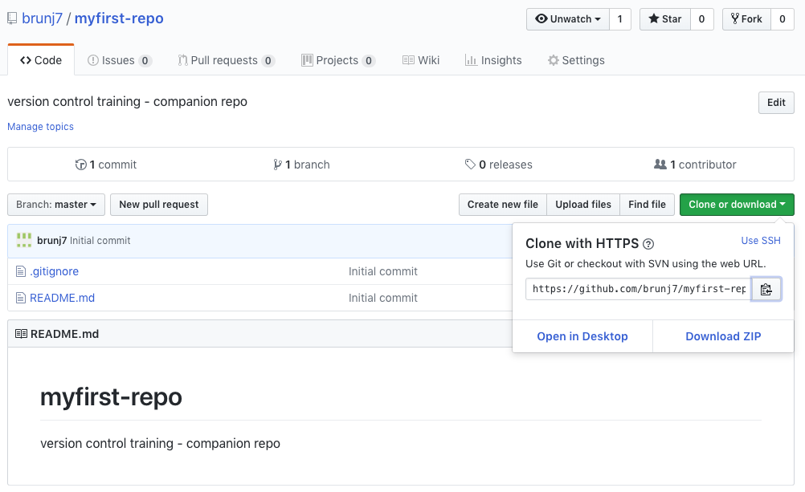
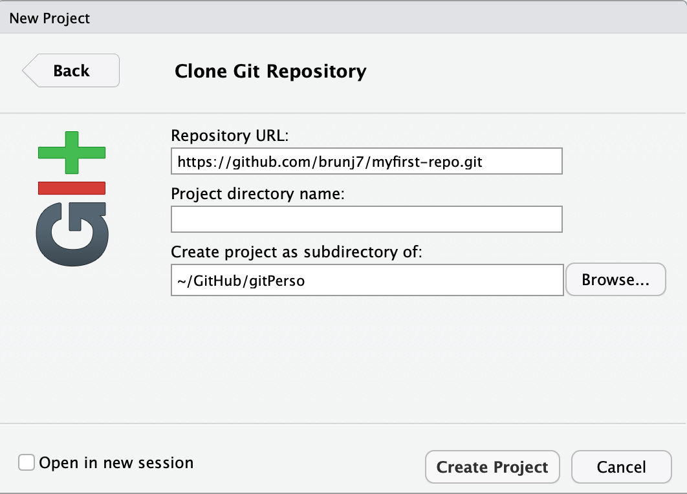
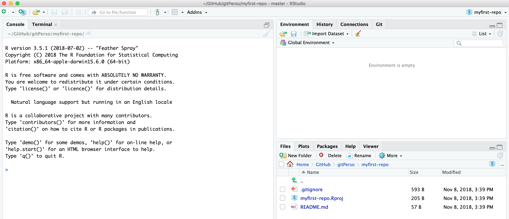
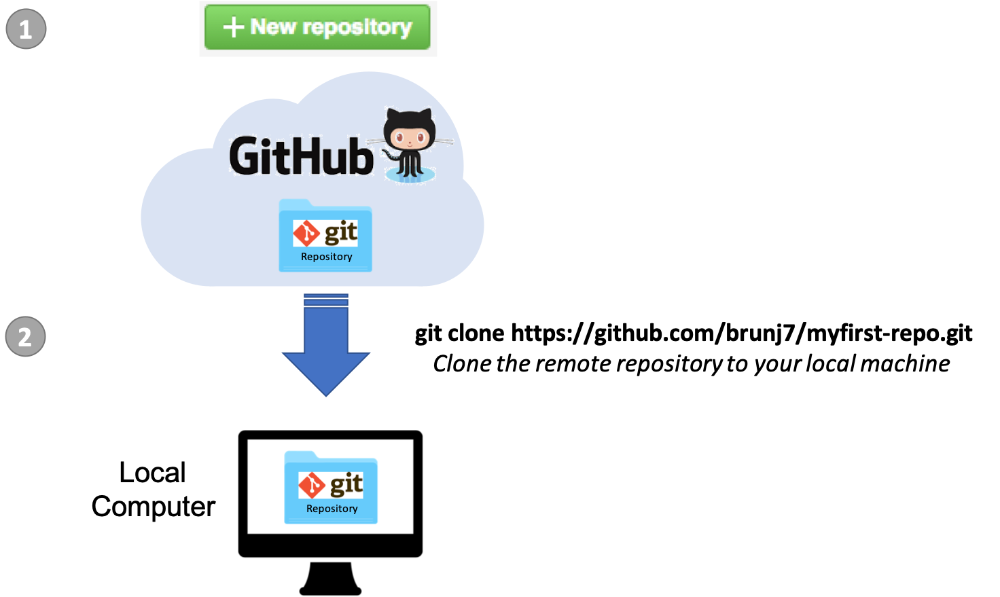

# First Repository

Git can be enabled on a specific folder/directory on your file system to version files within that directory (including sub-directories). In git (and other version control systems) terms, this “tracked folder” is called a **repository** (which formally is a specific data structure storing versioning information).

Although there many ways to start a new repository, [GitHub](https://github.com/) (or any other could solutions, such as [GitLab](https://about.gitlab.com/)) provide among the most convenient way of starting a repository.


## GitHub  

Let's distinguish between git and GitHub:

- __git__: version control software used to track files in a folder (a repository)
    - git creates the versioned history of a repository
- __GitHub__: web site that allows users to store their git repositories and share them with others
	
**GitHub is a company that hosts git repositories online** and provides several collaboration features (among which `forking`). GitHub fosters a great user community and has built a nice web interface to git, also adding great visualization/rendering capacities of your data.

- **GitHub.com**: <https://github.com>
- **A user account**: <https://github.com/brunj7>
- **An organization account**: <https://github.com/nceas>
- **NCEAS GitHub instance**: <https://github.nceas.ucsb.edu/> 

## Let's look at a GitHub repository

This screen shows the copy of a repository stored on GitHub,
with its list of files, when the files and directories were last modified, 
and some information on who made the most recent changes.  


If we drill into the 
"commits" for the repository, we can see the history of changes made to all of 
the files.  Looks like `kellijohnson` and `seananderson` were fixing things in
June and July:


And finally, if we drill into the changes made on June 13, we can see exactly what
was changed in each file:


Tracking these changes, how they relate to released versions of software and files
is exactly what Git and GitHub are good for.  And we will show how they can really 
be effective for tracking versions of scientific code, figures, and manuscripts
to accomplish a reproducible workflow.


## Creating a Repository on GitHub

We are going to create a new repository on your GitHub account. If you do not have an account yet, it is free to create one here: https://github.com/join?source=header-home

To create a new repository follow these steps:

- Click on 
- Enter a descriptive name for your new repository, `myfirst-repo`  
(avoid upper case and use `-` instead of spaces or `_`)
- Write a 1-sentence description about the repository content
- Choose **"Public"** (Private repositories are not free)
- Check **"Initialize this repository with a README"**
- Add a `.gitignore` file (optional). As the name suggest, the gitignore file is used to specify the file format that git should not track. GitHub offers pre-written gitignore files for commodity
- Add a license file (optional) 


 Here is a website to look for more pre-written`.gitignore` files: <https://github.com/github/gitignore>

<br>

**=> Here it is, you now have a repository in the cloud!!** 

 

<br>


## Getting a Local Copy of a Repository

The next step is going to **get a local copy of this repository to your personal computer**. In git jargon, creating an exact copy of a repository on your local computer is called **cloning**.

RStudio can help us to clone a repository. *Since `RStudio Projects` also work at the folder/directory level, it is the "unit" that is going to be used to link a repository to RStudio.*

1. You can create a new `RStudio Project` from the upper-right corner of the RStudio IDE window, choosing *New Project*  
```{r RStudio project, out.width='30%', fig.align='center', echo = FALSE}
knitr::include_graphics("images/rstudio-project.png")
```
2. Choose *Version Control*  
```{r RStudio project version control panel, out.width='50%', fig.align='center', echo = FALSE}
knitr::include_graphics("images/rstudio-project-version-control.png")
```
3. Select `git`
4. Go back to your web browser and from the GitHub repository page click on the green `clone or download` button and copy the URL to your repository  

5. Paste this URL in the first box and leave the second box empty. Finally select a location on your HD where the repository will be cloned to.
```{r RStudio project git panel, out.width='50%', fig.align='center', echo = FALSE}

```
6. Click `Create Project`


<br>

** => Congratulations!! you have cloned the repository to your computer and created a RStudio project out of it.**

```{r Cloned repository, fig.align='center', echo = FALSE}

```


<br>

You can also use your computer file browser to look at the files in the repository. You have two files:

- The `my-repo-name.Rproj` file for the RStudio Project you just created. Note that because we left the second box empty on step 5, the name of the repository was used to name the RStudio project.
- The `README.md` file that was automatically generated by GitHub when creating the repository

```{r Finder files view, out.width='50%', fig.align='center', echo = FALSE}
knitr::include_graphics("images/repo-finder-view.png")
```

If you look again at your repository page on GitHub you will noticed that the `.Rproj` file is not there. It is because this file was created by RStudio on your local machine and you have not yet try to synchronize the files between your local copy and the one in the cloud (remote copy in git jargon). Note also that the `.gitignore` file is not showing up in the Finder view. It is because files with a name starting with a dot are considered "hidden". By default most of OS will not show those files. However if you use the `Files` panel in RStudio, you can see the `.gitignore` file.

```{r rstudio files view, out.width='50%', fig.align='center', echo = FALSE}
knitr::include_graphics("images/rstudio-files-view.png")
```

We are going to edit the `README.md` file, adding more information about the repository (purpose of the this file). You can directly edit this file in RStudio. You can open the file by clicking on its name from the `Files` tab in the lower-right panel.